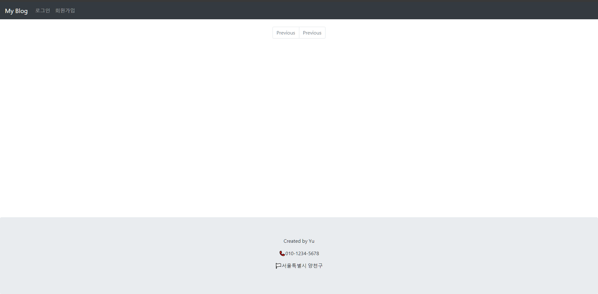
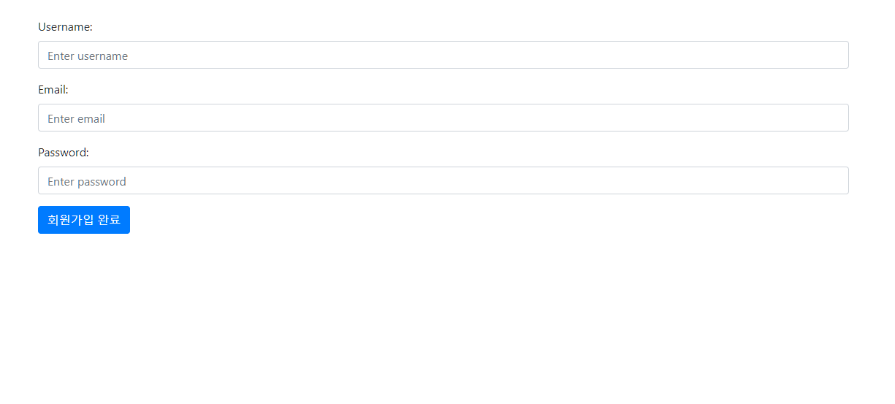
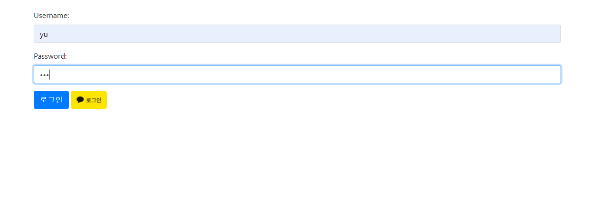
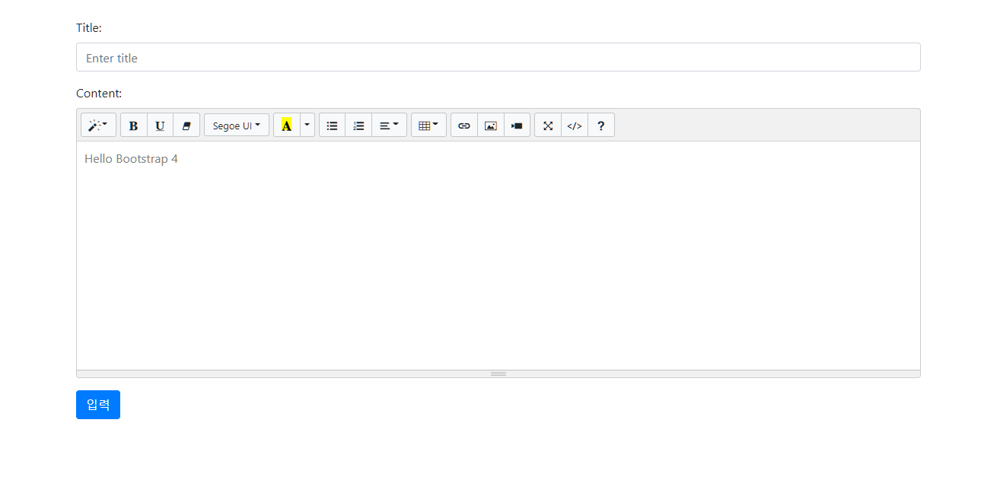
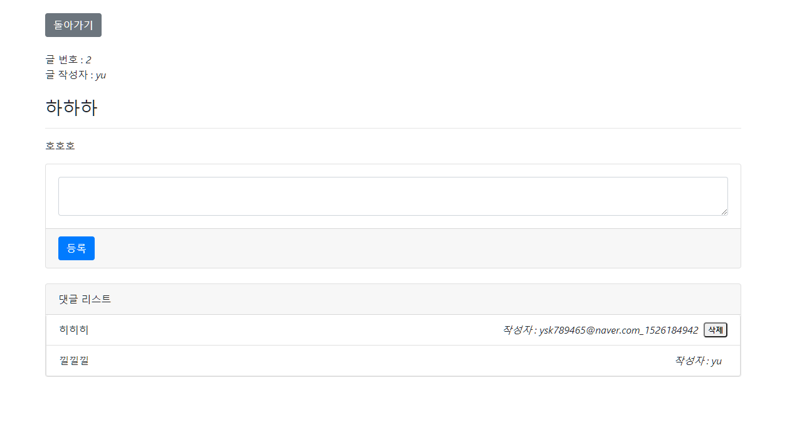
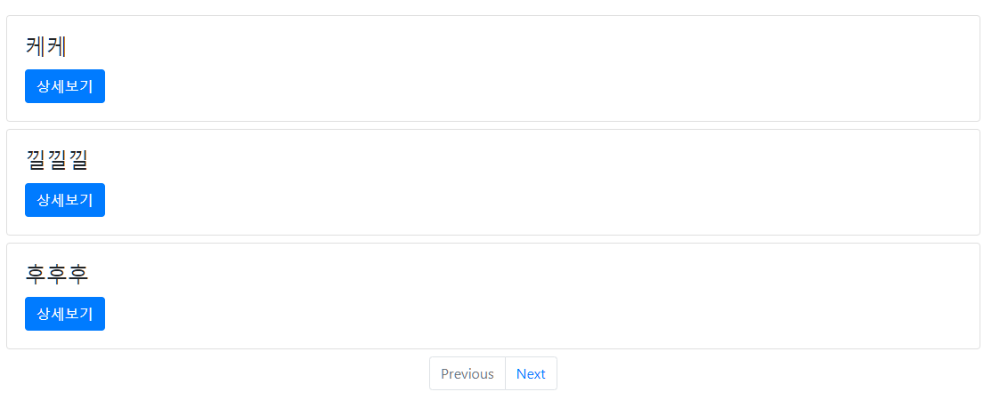
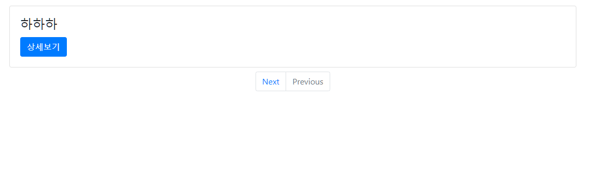

# Blog 프로젝트

## 1) Front-End

1. jsp 템플릿 엔진 + ajax(Axios)
2. JSTL

## 2) Back-End

1. Spring-boot
2. Spring-security
3. DB : mysql

## 3) DB 구조

1. User - Board ( 1: N )
2. User - Reply ( 1 : N )
3. Board - Reply ( 1 : N )

## 4) 프로젝트 진행과정 정리

[1. 프로젝트 세팅](https://www.notion.so/1-4f57e8f3ea77478a87231ea93a43f113)

[2. JPA 설정](https://www.notion.so/2-JPA-35836de3b72244fdb246145e1c0bdd97)

[3. 프로젝트 본격 구축 시작](https://www.notion.so/3-5d5033b4ee88444d9d305c0e87e8879b)

[4. 게시글 관리](https://www.notion.so/4-0fba6245d15a43a89c9c98288799f5bf)

[5. 회원 정보](https://www.notion.so/5-0a344f12f4d648268df96f95df909369)

[6. 카카오 로그인 구현](https://www.notion.so/6-72323e66b80e4dc889d334ab790ea10e)

[7. 댓글 구현](https://www.notion.so/7-87d97ed57e27427ca204348a6e0219ce)
 

## 5) 스크린샷

### 1. 메인 페이지

### 2. 회원가입 페이지

### 3. 로그인 페이지(Spring Security + Kakao Oauth)

### 4. 글쓰기

### 5. 글 상세보기(writer에 대해서만 글 삭제, 수정 가능)

### 6. Paging 처리

